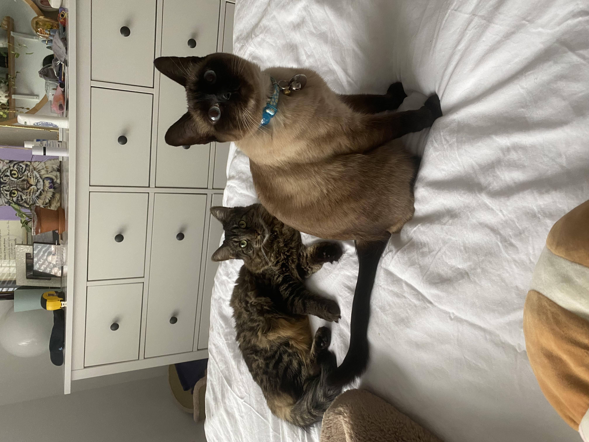
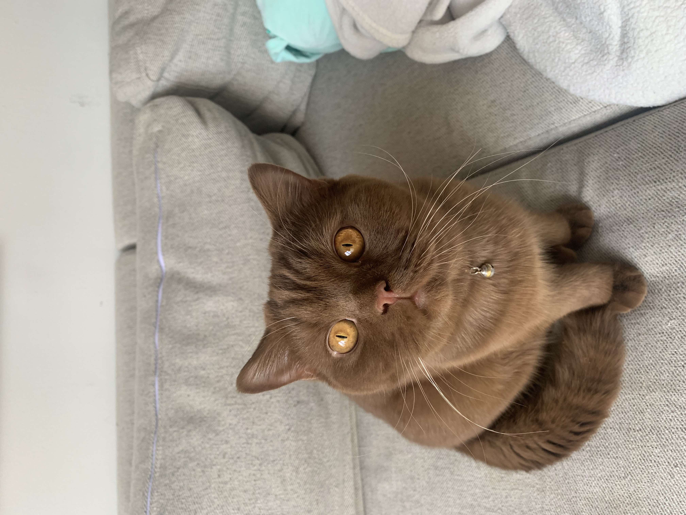

# Welcome!

This is my website for P8110: Data Science I Homework 4. Here, I have my educational and work experience located in the [Experience](experience.html) tab above. I also have the flexdashboard I created located in the [tbd](...) tab. 

### About Me: Ghislaine Jumonville
I am a second year MPH student in the epidemiology department at Columbia University Mailman School of Public Health. I'm originally from Huntington Beach, California, but have been living in New York for the past six years and going to school. Outside of school, I enjoy long walks, NYT games (especially the crossword), and hanging out with my cats (pictured below).

This is Lu (laying down) and Ophelia (sitting)!

This is Frank!

